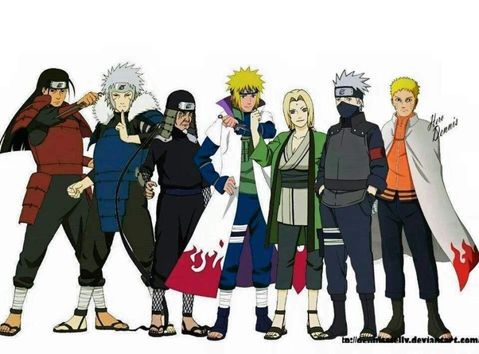

# Leader of Konohagakure

The position of Hokage is granted to individuals within the Leaf Village who show a strong sense of loyalty to the village, as well as individuals who are smart enough and strong enough to protect the village. A new Hokage is picked only in times of need, for example, when a previous Hokage dies, resigns, or is no longer fit to lead the village.  The quote that best describes this role is:
> "The Hokage is the one who steps forward to protect the village, even if it means throwing his own life away." 
> - Hiruzen Sarutobi
## Hokage In Order
1. Hashirama Senju
2. Tobirama Senju
3. Hiruzen Sarutobi
4. Minato Namikaze
5. Lady Tsunade
6. Kakashi Hatake
7. Naruto Uzumaki
### Alliances
The only successful alliance that has formed (pre-Fourth Great Shinobi War) is with the Sand Villages [[Kazekage]], Gaara. After a failed attack on the leaf village, Lady Tsunade formed an alliance with newly appointed Kazekage Gaara in an effort to bring more unity to the ninja world.

