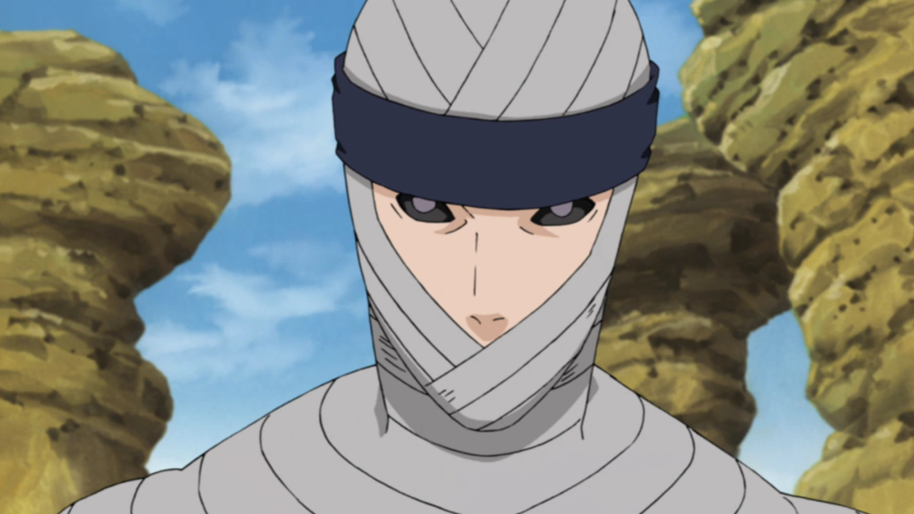

# Leader of Iwagakure

The Village Hidden in the Stone mirrors the Leaf Villages "Will of Fire" in that they look for members who possess the "Will of Stone", or are stubborn as a rock in their will to protect the village. This village uses a blend of Master/Student, hereditary lineage, and mastery over the Jinton release which is capable of disintegrating anything at the atomic level. The Will of Stone is usually best embodied in the Tsuchikage's overall stubborn behavior. One quote that best describes this position is:
>"...standing here alongside the next generation, I remember what it means to be the Tsuchikage: to be the bedrock that protects our future, no matter how heavy the boulder."
>- Onoki

## Tsuchikage In Order
1. Ishikawa
2. Mu
3. Onoki
4. Kurotsuchi

### Alliances
The Tsuchikage have historically only kept alliances with other villages at times of war. The first instance was then the First [[Hokage]] Hashirama gathered all Kage to evenly distribute the tailed beasts so as to not create any imbalances in power. Besides this, They currently hold an alliance with all other Kage as a result of the Fourth Great Ninja War.

